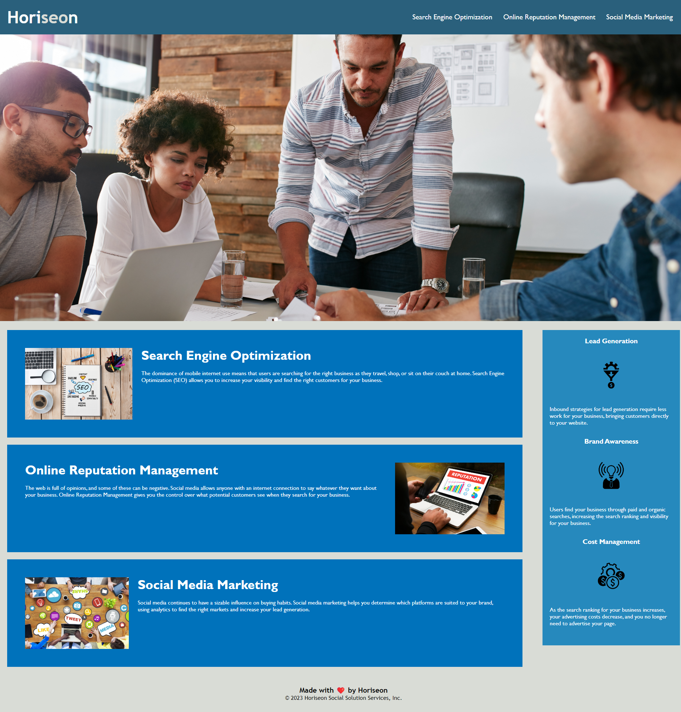

# Horiseon Website Accessibility Optimization

Welcome to the Horiseon Website Accessibility Optimization project repository! This repository is dedicated to enhancing the accessibility and search engine optimization (SEO) of the Horiseon website.
 

## Description

Horiseon, a marketing agency, recognizes the importance of providing an accessible and user-friendly website to reach a broader audience and improve search engine rankings. This project aims to achieve this goal by adhering to accessibility standards, using semantic HTML elements, ensuring a logical structure in HTML and CSS, and implementing SEO best practices. I discover the significance of web accessibility through this project, focusing on creating user-friendly websites that meet accessibility standards.
 

## Table of Contents

Use this table of contents to quickly navigate to the information you need:

- [User Story](#user-story)
- [Acceptance Criteria](#acceptance-criteria)
- [Screenshot](#screenshot)
- [Usage](#usage)
- [Credits](#credits)
- [Features](#features)
- [Deployment](#deployment)
- [License](#license)
- [Badges](#badges)

 

## User Story

**AS A marketing agency, I WANT** a codebase that follows accessibility standards, **SO THAT** our own site is fully optimized for search engines.
 

## Acceptance Criteria

This Acceptance criteria is presented in a widely recognized format known as scenario-oriented criteria.

**Given** that we are ensuring accessibility standards for the website,
**When** we inspect the source code,
**Then** the following requirements must be met:

- **When** we inspect the source code, 
**Then** Semantic HTML elements should be used extensively.

- **When** we structure HTML elements,
**Then** they must follow a logical hierarchy that is independent of styling and positioning.

- **When** we include images and icons,
**Then** they should have appropriate and informative `alt` attributes.

- **When** we arrange heading elements,
**Then** they should maintain a sequential order for content structure.

- **When** we provide a title,
**Then** it should be concise and descriptive.
 

## Screenshot

*The image above provides a visual representation of the main page after my Code Refactor for an On-the-job ticket. It showcases both the appearance and functionality of the web application.*

> **note:** This layout is designed for desktop viewing, so you may notice that some of the elements don't look like the Screenshot at a resolution smaller than 768px. 
 

## Usage

To view the Horiseon Website Accessibility Optimization project locally or make use of the code, follow these steps:

1. **Clone the Repository:**
`git clone https://github.com/deponte-designer/horiseon-website-accessibility-optimization.git`

2. **Navigate to the Project Directory:**
`cd horiseon-website-accessibility-optimization`

3. **Open the HTML File:**
- Locate the `index.html` file in your code editor.
- Open it in a web browser to view the project.

Feel free to explore the code, make modifications, and provide feedback. If you have suggestions or improvements to share, please don't hesitate to create a pull request or submit an issue on the GitHub repository.

>Your input and contributions are highly valuable, and they will help enhance the project further!
 

## Credits

### Tutorials and Resources

#### For the README.md file
- [Awesome README examples](https://github.com/matiassingers/awesome-readme)
- Articles on Acceptance Criteria:
  - [Acceptance Criteria for User Stories: Purposes, Formats, Examples, and Best Practices](https://www.altexsoft.com/blog/business/acceptance-criteria-purposes-formats-and-best-practices/)
  - [Acceptance Criteria: Why It’s Important and How to Write It](https://blog.american-technology.net/acceptance-criteria/)
- [Markdown Cheat Sheet](https://www.markdownguide.org/cheat-sheet)
- [Markdown Badges](https://github.com/Ileriayo/markdown-badges)

#### For the index.html file
- [Semantic HTML](https://www.w3schools.com/html/html5_semantic_elements.asp)
- [Image `alt` attributes](https://www.w3schools.com/tags/att_img_alt.asp)
- [Semantic HTML `<main>`](https://www.codecademy.com/resources/docs/html/semantic-html/main)
- [Bootstrap 4 Navs](https://www.w3schools.com/bootstrap4/bootstrap_navs.asp)

#### For the style.css file
- [Alternate text for background images - Considerations and techniques](https://www.davidmacd.com/blog/alternate-text-for-css-background-images.html)
- [W3C: Techniques for WCAG 2.0](https://www.w3.org/TR/2008/NOTE-WCAG20-TECHS-20081211/F3)
- [CSS Backgrounds](https://www.w3schools.com/css/css_background.asp)
- [CSS CheatSheet](https://htmlcheatsheet.com/css/)

#### Website Accessibility Testing
- [Web Accessibility Evaluation Report](https://wave.webaim.org/report#/https://deponte-designer.github.io/horiseon-website-accessibility-optimization/)
 

## Features

During the development of this project, I encountered several challenges as it was my first project. I invested a lot of time in research to implement the best methodologies. While the project is functional, there are several features I hope to implement in the future to enhance its quality and user experience:

1. **Improved Image Quality:** I plan to replace current images with higher-quality ones to enhance visual appeal.

2. **Back-to-Top Icon:** Adding a smooth "scroll to top" icon for better navigation on longer pages.

3. **Enhanced User-Friendly Interactions:** Implementing more user-friendly interactions to create a smoother browsing experience.

4. **Animations:** Incorporating subtle animations to make the static website more engaging and visually appealing.

5. **Auto Date in Footer:** Automatically updating the date in the footer, providing a more dynamic feel.

>Your support and feedback are greatly appreciated as I work on these improvements!
 

## Deployment

This project is deployed and accessible at the following URLs:

- [Live Application](https://deponte-designer.github.io/horiseon-website-accessibility-optimization): Explore the demo live version of the website.

- [GitHub Repository](https://github.com/deponte-designer/horiseon-website-accessibility-optimization): Visit the repository for the project, which includes a README describing the details.
 

## Conclusion

Thank you for visiting the Horiseon Website Accessibility Optimization project. Your support, feedback, and contributions are greatly appreciated as we work to make the web more accessible and user-friendly. If you have any suggestions, issues to report, or ideas for collaboration, please don't hesitate to reach out. Together, we can continue to improve this project and create a better web experience for everyone.

**Happy coding!**
 

## License

Copyright (c) 2023 [dePonte](https://github.com/deponte-designer)

Permission is hereby granted, free of charge, to any person obtaining a copy of this software and associated documentation files (the "Software"), to deal in the Software without restriction, including without limitation the rights to use, copy, modify, merge, publish, distribute, sublicense, and/or sell copies of the Software, and to permit persons to whom the Software is furnished to do so, subject to the following conditions:

The above copyright notice and this permission notice shall be included in all copies or substantial portions of the Software.

THE SOFTWARE IS PROVIDED "AS IS", WITHOUT WARRANTY OF ANY KIND, EXPRESS OR IMPLIED, INCLUDING BUT NOT LIMITED TO THE WARRANTIES OF MERCHANTABILITY, FITNESS FOR A PARTICULAR PURPOSE AND NONINFRINGEMENT. IN NO EVENT SHALL THE AUTHORS OR COPYRIGHT HOLDERS BE LIABLE FOR ANY CLAIM, DAMAGES OR OTHER LIABILITY, WHETHER IN AN ACTION OF CONTRACT, TORT OR OTHERWISE, ARISING FROM, OUT OF OR IN CONNECTION WITH THE SOFTWARE OR THE USE OR OTHER DEALINGS IN THE SOFTWARE.
 

## Badges

 
